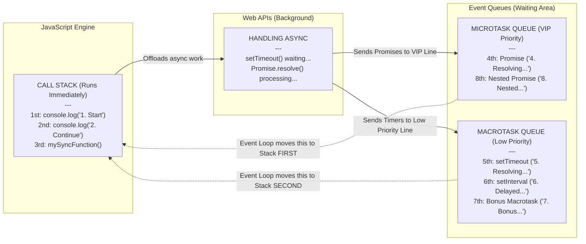

# JavaScript Event Loop Basics

This mini-project demonstrates how JavaScript prioritizes executing code using the **Call Stack**, **Microtasks**, and **Macrotasks**.

## 1. The 3 Golden Rules of Execution

JavaScript is single-threaded. Because it can only do one task at a time, it strictly follows this 1-2-3 priority order:

1. **Synchronous Code (Call Stack) goes FIRST.**
   Normal code runs instantly, exactly where it is written.
   _Examples: `console.log()`, math operations, arrays, and standard function calls._
2. **Microtasks (Promises) go SECOND.**
   This is the high-priority queue. JavaScript runs these the exact millisecond the synchronous code finishes.
   _Examples: `Promise.then()`, `fetch()` data resolving, and `queueMicrotask()`._
3. **Macrotasks go THIRD.**
   This is the low-priority queue. Everything here must wait until the Call Stack and the Microtask queue are totally empty before running.
   _(Examples include: Timers like `setTimeout` and `setInterval`, User UI Events like clicks or scrolls, and Network I/O callbacks)._

---

## 2. System Architecture Diagram

Here is the "Big Picture" showing exactly how the JavaScript Engine passes work to the Browser (Web APIs) and eventually to the Memory Queues:

### Let's connect the Diagram to our Code (`app.js`):

To make this super easy to understand, let's see how the diagram handles the code inside our `app.js` file:

1. **JavaScript Engine (Call Stack):**
   The engine reads synchronous code like `console.log("1. Main Execution Start")` and executes it instantly on the main Call Stack.

2. **Web APIs (Background):**
   When the engine sees `Promise.resolve()` and `setTimeout()`, it knows these are asynchronous tasks. It hands them off to the Browser's background workers (Web APIs) and keeps moving down the file.

3. **Event Queues:**
   - The Browser prepares the `Promise` and places its callback into the **Microtask Queue** (The VIP high-priority line).
   - The Browser prepares the `setTimeout` and places its callback into the **Macrotask Queue** (The regular low-priority line).

4. **The Event Loop in Action:**
   Once the entire file has been read and all normal synchronous code finishes (meaning the Call Stack is now empty), the Event Loop steps in:
   - **Step 1:** It checks the **Microtask Queue** first and says, *"VIPs go first!"* It moves the Promise code to the Call Stack to run.
   - **Step 2:** Only when the Microtask Queue is *completely empty*, it checks the **Macrotask Queue** and moves the `setTimeout` code to the Call Stack to run.

---

## 3. Written Order vs Execution Order

If you look inside our `app.js` file, you will notice the code is written strictly top-to-bottom. However, because of the Event Loop queues, JavaScript reads and executes the code out of order!

- **Written 2nd (`setTimeout`)** gets pushed to the back of the line and **RUNS 5th**.
- **Written 3rd (`Promise`)** jumps into the high-priority line and **RUNS 4th**.
- **Written 6th (Normal Function)** stays on the main thread and **RUNS 3rd**.
- **Written 7th (Bonus Task)** proves that if a Macrotask creates a Microtask, the engine pauses to run it immediately (**RUNS 8th**)!

### How to test it out:

1. Open `index.html` in your browser.
2. Open your Developer Tools (Right Click -> Inspect).
3. Navigate to the **Console** tab.
4. Reload the page and watch the execution! Notice how the true run order differs dramatically from the written top-to-bottom code.

---

## 4. Beginner-Friendly Resources for Async JS

Want to dive deeper into `Promises`, `async/await`, and the Event Loop? Start here:

1. **[What the heck is the event loop anyway? (JSConf EU)](https://www.youtube.com/watch?v=8aGhPhVfaqM)** _(YouTube)_
   This is the golden standard. It is the absolute best, most highly-visual, and entertaining presentation ever created detailing exactly how the Call Stack and Task Queues work.

2. **[The Modern JavaScript Tutorial: Promises & async/await](https://javascript.info/async)** _(Article)_
   An incredibly well-written, easy-to-read tutorial series. It breaks down complex topics into bite-sized, beginner-friendly chapters with great code examples.

3. **[Loupe by Philip Roberts](http://latentflip.com/loupe/)** _(Interactive Tool)_
   A fantastic playground website where you can actually paste your JavaScript code and watch a live animation of the engine sorting it into the Call Stack and Web APIs in real-time!
